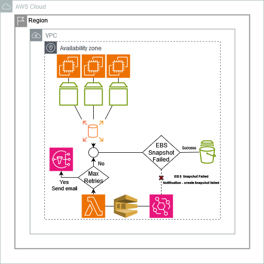

## Failed EBS Snapshot Recovery
EBS Snapshot creation might failed, even when they are managed by Amazon Data Lifecycle Manager, with users often unaware of what happened until they need that snapshot which has been failed.

This sample performs a recovery operations on Amazon EC2 snapshots by defining a Lambda function that will be triggered by SQS messages where each message contains details about a snapshot creation failure.
In particular, the lambda is *applied to only snapshots tagged with specific tag* **source_tag_Key=source_tag_Value** which has to be *defined in the environment variables*. Recovery snapshot are marked by the lambda by appending the tag  **snapshot_recovery_tag_Key=snapshot_recovery_tag_Value** which has to be *defined in the environment variables*
**Please note that this is a sample to review and to modify according to your needs**.
In addition, evaluate to periodically review and clean-up the snapshots create by this solution which are actually tagged properly, see  *snapshot_recovery_tag_Key=snapshot_recovery_tag_Value*.


## How does it work?
Whenever a EBS Snapshot creation is an asynchronous process with [**createSnapshot**](https://docs.aws.amazon.com/ebs/latest/userguide/ebs-cloud-watch-events.html#create-snapshot-complete) event which results either **succeeded** or **failed**. Therefore, an **EventBridge Rule** can be created to send such events to an SQS queue to trigger a Lambda that will run another EBS Snapshot creation, trying to recovery the source event resulted from a temporary problem. The smart mechanism is that in case the Lambda fails, a creteSnapshot failed is generated and the corresponding EventBridge rule will run, enqueing the event to the SQS. The python code includes a **tagcounter** to limit the maximum number of attempts to five, decreasing it every time a previously recovery snapshot attempt failed, sending a notification via SNS when the **tagcounter** reaches zero, i.e., when the lambda exhausted all the attempts we set.

<p align="center">
  
</p>

## Instructions

### CloudFormation
*Coming soon*

### Manual deploy

#### Step 1. Create a new policy
Create a new IAM policy **recovery-createSnapshot-policy** to allow the following actions related to lambda.
Replace **AWSREGION** and **AWSACCOUNT** in the policy below, with the corresponding region and account ID it will run on

```
{
    "Version": "2012-10-17",
    "Statement": [
        {
            "Effect": "Allow",
            "Action": "logs:CreateLogGroup",
            "Resource": "arn:aws:logs:AWSREGION:AWSACCOUNT:*"
        },
        {
            "Effect": "Allow",
            "Action": [
                "logs:CreateLogStream",
                "logs:PutLogEvents"
            ],
            "Resource": [
                "arn:aws:logs:AWSREGION:AWSACCOUNT:log-group:/aws/lambda/createSnapshot-failed-lambda:*"
            ]
        },
        {
            "Effect": "Allow",
            "Action": [
                "sqs:DeleteMessage",
                "sqs:GetQueueAttributes",
                "sqs:ReceiveMessage"
            ],
            "Resource": "arn:aws:sqs:AWSREGION:AWSACCOUNT:createSnaphot-failed-SQS"
        },
        {
            "Effect": "Allow",
            "Action": [
                "ec2:CreateSnapshot",
                "ec2:CreateTags",
                "ec2:ModifySnapshotAttribute",
                "ec2:DescribeInstances*",
                "ec2:DescribeSnapshots"
            ],
            "Resource": "*"
        },
        {
            "Sid": "PublishSNSMessage",
            "Effect": "Allow",
            "Action": "sns:Publish",
            "Resource": "arn:aws:sns:AWSREGION:AWSACCOUNT:createSnapshot-failed-sns-topic"
        }
    ]
}
```

Then, create an IAM role **createSnapshot-failed-role** for tje service AWS Lambda, attaching the policy **recovery-createSnapshot-policy** to it.

#### Step 2. Create a SNS Topic to delivery communiction when the maximum number of attempts is exhausted
Create a topic with name **createSnapshot-failed-sns-topic**, create the corresponding subscription and confirm it.

#### Step 3. Create a Lambda function
Create a Lambda with
- **Function name:** *createSnapshot-failed-lambda*
- **Runtime:** *Python 3.12*

In the wizard, open *Change default execution role* to *Use an existing role" setting the IAM role **createSnapshot-failed-role**.

Once the function has been created, copy the code available in **recovery-createSnashot-failed.py** and paste it in the lambda *Code* tab, then press *Deploy* to commit the changes.

Then, move into the Lambda *configuration* tab to set **Timeout to 1 minute** and to configure the **Environment variables** as follow
- **source_tag_Key** the tag key the lambda will look for on the failed snapshot to proceed in the recovery mechanism, e.g., *EBS-Snapshot*
- **source_tag_Value**  the tag value the lambda will look for on the failed snapshot to proceed in the recovery mechanism, e.g., *LambdaRecovery*
- **snapshot_recovery_tag_Key** the tag key appened by lambda to mark the snapshot it has generated, e.g., *Retention*
- **snapshot_recovery_tag_Value** the tag value appened by lambda to mark the snapshot it has generated, e.g., *30*
- **snapshot_recovery_max_retries_sns** with the SNS topic ARN, e.g., *arn:aws:sns:AWSREGION:AWSACCOUNT:createSnapshot-failed-sns-topic*

Therefore, the lambda function scope is limited to those EBS snapshot with **source_tag_Key=source_tag_Value**, otherwise it will exit.
The lambda marks the recovered snapshot by appending **snapshot_recovery_tag_Key=snapshot_recovery_tag_Value**.
Feel free to append additional tags, if needed.

#### Step 4. Create an SQS 
This SQS queue will be feed by EventBridge and it will trigger the lambda.
Create an SQS *Standard* with name *createSnaphot-failed-SQS* and *Visibility timeout=60* with basic access policy.
Then, select *Lambda triggers* and *Configure Lambda function trigger* selecting the lambda created in the previous step. 

#### Step 5. Create an EventBridge rule 
Go to EventBridge, select *Rule* on the left menu and press **Create Rule**.
Define the Rule detail as follow:
- **Name:** *createSnapshot-failed*
- **Event bus:** default
- **Rule type:** Rule with an event pattern
  
Press *Next*. Now, scroll down to **Event pattern** and press **Edit Pattern** pasting the following rule
```
{
  "source": ["aws.ec2"],
  "detail-type": ["EBS Snapshot Notification"],
  "detail": {
    "event": ["createSnapshot"],
    "result": ["failed"]
  }
}
```
Click on **{}Prettify** and click *Next*.

In the **Select target(s)** window
- **Target Type:** AWS service
- **Select Target:** Lambda Function
- **Function:** createSnaphot-failed-SQS

press *Next* and in *Select target(s)* select **SQS queue** and under *Queue* select **createSnaphot-failed-SQS** which has been creatd in the previous step.
Then, press *Next* and again *Next*, review the rule and create it.

#### Step 6. Test it

The solution can be tested by changing **"result": ["succeeded"]** within the **Event pattern** and manually create a snapshot from a volume.
Then, you have to ***immediately restore** the **"result": ["failed"]** in the **Event pattern** to ***avoid a loop*** of EBS Snapshots created by the lambda.
Once you will review the CloudWatch logs and you will find the resulting EBS Snapshot, feel free to remove the resulting EBS Snapshot(s).

## Security

See [CONTRIBUTING](CONTRIBUTING.md#security-issue-notifications) for more information.

## License

This library is licensed under the MIT-0 License. See the LICENSE file.

